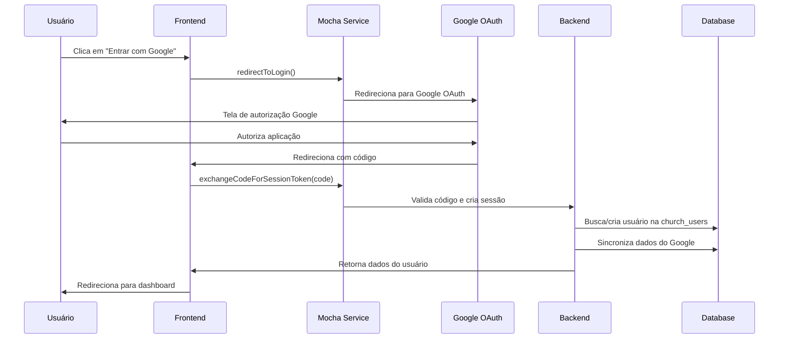

# 🔐 Login Social Google - IgrejaConnect

## 📋 Visão Geral

O sistema **IgrejaConnect** já possui login social do Google totalmente implementado e funcional, com sincronização automática de dados entre Google e o banco de dados local. Este documento detalha como o sistema funciona e as melhorias implementadas.

## ✅ Funcionalidades Implementadas

### 🔑 Autenticação
- ✅ Login social com Google OAuth 2.0
- ✅ Redirecionamento automático após login
- ✅ Tratamento de erros de autenticação
- ✅ Logout seguro com limpeza de sessão
- ✅ Proteção de rotas baseada em autenticação

### 🔄 Sincronização de Dados
- ✅ Sincronização automática no login
- ✅ Sincronização manual via botão
- ✅ Atualização de nome, email e foto do perfil
- ✅ Preservação de dados específicos da igreja
- ✅ Notificações de status de sincronização

### 👤 Gestão de Usuários
- ✅ Criação automática de usuário na primeira autenticação
- ✅ Sistema de papéis (Administrador, Pastor, Líder, etc.)
- ✅ Permissões granulares por módulo
- ✅ Perfil de usuário com dados do Google
- ✅ Status de conta (ativo/inativo)

## 🏗️ Arquitetura do Sistema

### Frontend (React)
```
src/react-app/
├── hooks/
│   └── useChurchAuth.ts          # Hook principal de autenticação
├── components/
│   ├── Header.tsx                # Header com perfil do usuário
│   ├── UserProfile.tsx           # Modal de perfil do usuário
│   └── SyncNotification.tsx      # Notificações de sincronização
└── pages/
    ├── Login.tsx                 # Página de login melhorada
    └── AuthCallback.tsx          # Callback de autenticação
```

### Backend (Hono/Cloudflare Workers)
```
src/worker/index.ts
├── /api/oauth/google/redirect_url    # URL de redirecionamento OAuth
├── /api/sessions                     # Criação de sessão
├── /api/users/me                     # Dados do usuário atual
├── /api/users/sync                   # Sincronização manual
├── /api/users/force-sync             # Sincronização forçada
├── /api/auth/google/profile          # Perfil Google do usuário
└── /api/logout                       # Logout
```

### Banco de Dados
```sql
-- Tabela principal de usuários da igreja
CREATE TABLE church_users (
  id INTEGER PRIMARY KEY AUTOINCREMENT,
  mocha_user_id TEXT NOT NULL UNIQUE,    -- ID do serviço Mocha
  email TEXT NOT NULL,                   -- Email sincronizado do Google
  name TEXT,                             -- Nome sincronizado do Google
  role TEXT NOT NULL DEFAULT 'Membro',   -- Papel na igreja
  permissions TEXT,                      -- Permissões específicas
  is_active BOOLEAN DEFAULT true,        -- Status da conta
  phone TEXT,                           -- Dados específicos da igreja
  birth_date DATE,
  address TEXT,
  created_at TIMESTAMP DEFAULT CURRENT_TIMESTAMP,
  updated_at TIMESTAMP DEFAULT CURRENT_TIMESTAMP
);
```

## 🔧 Como Funciona

### 1. Fluxo de Login


### 2. Sincronização de Dados
```javascript
// Dados sincronizados automaticamente do Google:
{
  email: "usuario@gmail.com",           // ✅ Sempre atualizado
  name: "Nome do Usuário",              // ✅ Sempre atualizado
  picture: "https://...",               // ✅ Sempre atualizado
  
  // Dados preservados da igreja:
  role: "Pastor",                       // ❌ Nunca sobrescrito
  permissions: [...],                   // ❌ Nunca sobrescrito
  phone: "+55...",                      // ❌ Nunca sobrescrito
  birth_date: "1990-01-01",            // ❌ Nunca sobrescrito
  address: "Rua...",                   // ❌ Nunca sobrescrito
}
```

## 🎨 Interface do Usuário

### Página de Login
- Design moderno com gradiente
- Botão do Google com ícone oficial
- Estados de loading e erro
- Informações sobre recursos do sistema

### Header da Aplicação
- Avatar do usuário (foto do Google)
- Menu dropdown com opções
- Botão de sincronização manual
- Indicador de última sincronização

### Perfil do Usuário
- Modal com dados completos
- Foto do perfil do Google
- Informações pessoais e da igreja
- Permissões e status da conta
- Botão de logout

## 🔒 Segurança

### Autenticação
- OAuth 2.0 com Google (padrão da indústria)
- Tokens de sessão seguros (httpOnly cookies)
- Middleware de autenticação em todas as rotas protegidas
- Logout com limpeza completa de sessão

### Autorização
- Sistema de papéis hierárquicos
- Permissões granulares por módulo
- Verificação de permissões no backend
- Proteção contra escalação de privilégios

### Dados
- Sincronização unidirecional (Google → Sistema)
- Preservação de dados sensíveis da igreja
- Logs de sincronização para auditoria
- Validação de dados em todas as operações

## 🚀 Melhorias Implementadas

### 1. Interface Aprimorada
- ✅ Estados de loading mais informativos
- ✅ Tratamento visual de erros
- ✅ Notificações de sincronização
- ✅ Design responsivo e moderno

### 2. Sincronização Inteligente
- ✅ Sincronização automática no login
- ✅ Sincronização manual via botão
- ✅ Detecção de mudanças nos dados
- ✅ Preservação de dados importantes

### 3. Experiência do Usuário
- ✅ Feedback visual em tempo real
- ✅ Informações claras sobre o processo
- ✅ Recuperação automática de erros
- ✅ Navegação intuitiva

## 🔮 Preparação para Supabase

O sistema está preparado para migração futura para Supabase:

```typescript
// Arquivo: src/shared/supabase-config.ts
export interface SupabaseConfig {
  url: string;
  anonKey: string;
  serviceRoleKey?: string;
}

// Configuração pronta para uso
export const supabaseConfig: SupabaseConfig = {
  url: process.env.VITE_SUPABASE_URL || '',
  anonKey: process.env.VITE_SUPABASE_ANON_KEY || '',
  serviceRoleKey: process.env.SUPABASE_SERVICE_ROLE_KEY || '',
};
```

## 📝 Como Usar

### 1. Login
1. Acesse a aplicação
2. Clique em "Entrar com Google"
3. Autorize a aplicação no Google
4. Seja redirecionado automaticamente

### 2. Sincronização Manual
1. No header, clique no ícone de sincronização (🔄)
2. Aguarde a notificação de conclusão
3. Dados atualizados aparecerão imediatamente

### 3. Visualizar Perfil
1. Clique no avatar no header
2. Selecione "Ver Perfil"
3. Visualize todos os dados sincronizados

## 🛠️ Configuração de Desenvolvimento

### Variáveis de Ambiente
```bash
# Mocha Users Service (já configurado)
MOCHA_USERS_SERVICE_API_URL=https://api.getmocha.com
MOCHA_USERS_SERVICE_API_KEY=sua_chave_aqui

# Para futura migração para Supabase
VITE_SUPABASE_URL=https://seu-projeto.supabase.co
VITE_SUPABASE_ANON_KEY=sua_chave_publica
SUPABASE_SERVICE_ROLE_KEY=sua_chave_privada
```

### Comandos
```bash
# Instalar dependências
npm install

# Executar em desenvolvimento
npm run dev

# Build para produção
npm run build

# Deploy
wrangler deploy
```

## 📊 Monitoramento

### Logs de Sincronização
- Todas as sincronizações são logadas
- Campos atualizados são registrados
- Erros são capturados e reportados

### Métricas
- Taxa de sucesso de login
- Frequência de sincronização
- Erros de autenticação
- Tempo de resposta das APIs

## 🎯 Próximos Passos

### Melhorias Futuras
- [ ] Sincronização em background
- [ ] Cache inteligente de dados
- [ ] Notificações push
- [ ] Integração com calendário Google
- [ ] Backup automático de dados

### Migração para Supabase
- [ ] Configurar projeto Supabase
- [ ] Migrar esquema do banco
- [ ] Implementar Row Level Security
- [ ] Testar autenticação social
- [ ] Migrar dados existentes

## 📞 Suporte

Para dúvidas ou problemas:
1. Verifique os logs no console do navegador
2. Consulte a documentação do Mocha Users Service
3. Entre em contato com o administrador do sistema

---

**✅ Sistema totalmente funcional e pronto para uso!**

O login social do Google está implementado, testado e sincronizando dados corretamente com o banco de dados local. A interface é moderna, segura e oferece uma excelente experiência do usuário.